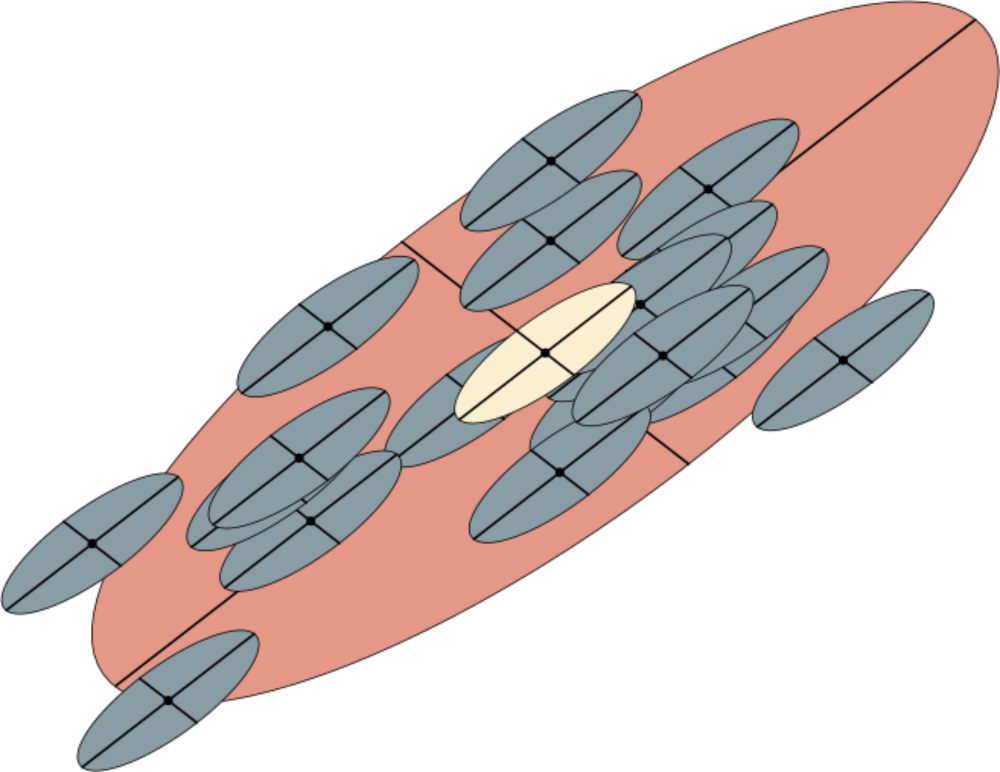

```{r setup, include=FALSE}
knitr::opts_chunk$set(echo = TRUE)
```


# Leitura da Aula 5

- [Did Natural Selection or Genetic Drift Produce the Cranial Diversification of Neotropical Monkeys?](http://www.journals.uchicago.edu/doi/10.1086/381693) ([pdf](https://github.com/lem-usp/site-bio208/raw/master/static/pdfs/artigos/Marroig%2C%20Cheverud%20-%202004%20-%20Did%20natural%20selection%20or%20genetic%20drift%20produce%20the%20cranial%20diversification%20of%20neotropical%20monkeys.pdf))

    __Abstract:__
    A central controversy among biologists is the relative importance of natural selection and genetic drift as creative forces shaping biological diversification (Fisher 1930; Wright 1931). Historically, this controversy has been an effective engine powering several evolutionary research programs during the last century (Provine 1989). While all biologists agree that both processes operate in nature to produce evolutionary change, there is a diversity of opinion about which process dominates at any particular organizational level (from DNA and proteins to complex morphologies). To address this last level, we did a broadscale analysis of cranial diversification among all living New World monkeys. Quantitative genetic models yield specific predictions about the relationship between variation patterns within and between populations that may be used to test the hypothesis that genetic drift is a sufficient explanation for morphological diversification. Diversity at several levels in a hierarchy of taxonomic/phylogenetics relationship was examined from species within genera to families within superfamilies. The major conclusion is that genetic drift can be ruled out as the primary source of evolutionary diversification in cranial morphology among taxa at the level of the genus and above as well as for diversification of most genera. However, drift may account for diversification among species within some Neotropical primate genera, implying that morphological diversification associated with speciation need not be adaptive in some radiations.

# Objetivos da Aula 5

- Estimar as matrizes de covariância dos nós ancestrais
    - Estimar os PCs das matrizes ancestrais
- Comparar os componentes principais das matrizes dentro e entre grupos

## Matrizes ancestrais

O calculo das matrizes ancestrais é feito como uma média ponderada das matrizes ao longo da filogenia. Isso é equivalente a calcular uma matriz de covariância usando a fórmula usual da covariância, mas substituindo a média global pela média da espécie do indivíduo sendo considerado. Se $\overline{z^i}_{sp[k]}$ representa a média da espécie do indivíduo $k$ para o caráter $i$, a matriz de covariância para um nó ancestral é dada por:

$$
Cov(z^i, z^j) = \frac{1}{N} \sum_{k = 1}^{N} (z_{k}^i - \overline{z^i}_{sp[k]})(z_{k}^j - \overline{z^j}_{sp[k]})
$$

Onde a soma é feita para todos os indivíduos para a espécies descendentes do nó em questão. Vamos testar essa história. Primeiro vamos carregar os dados e calcular as matrizes para todas as espécies atuais.

```{r}
if(!require(evolqg)){install.packages("evolqg"); library(evolqg)}
data(dentus)
cov_matrices = dlply(dentus, .(species), function(x) cov(x[,1:4]))
```

A matriz do ancestral comum entre as espécies A e C é dada pela ponderada entre as matrizes atuais:

```{r}
cov_matrix_AC = (60 * cov_matrices$A + 60 * cov_matrices$C)/120
cov_matrix_AC
```

A ideia é que essa matriz é a mesma coisa que fazer a covariância normalmente, mas usando a média das espécies separadamente. Vamos usar a formula de covariância diretamente, mas controlando para o número de graus de liberdade:

```{r}
means = daply(dentus, .(species), function(x) colMeans(x[,1:4]))
dentus_AC = dentus[dentus$species == "A" | dentus$species == "C",]
medias_AC = means[dentus[dentus$species == "A" | dentus$species == "C", 5],]

# Essa correção pelos graus de liberdade é meio confusa, mas pense que a var()
# vai tirar um grau de liberdade, mas a gente calculou duas médias,
# então precisamos tirar outro!
(119/(119-1)) * var(dentus_AC[,1:4] - medias_AC)
```

Bacana, deu a mesma coisa. Outra solução nesse caso é escrever o problema como uma regressão linear e extrair a covariância dos residuos:

```{r}
residuos_AC = residuals(lm(as.matrix(dentus_AC[,1:4])~dentus_AC[,5]))
(119/(119-1)) * cov(residuos_AC)
```

O resultado é o mesmo. Você pode ler o termo `as.matrix(dentus_AC[,1:4])~dentus_AC[,5]` como: _as colunas de 1 a 4 do objeto dentus_AC em função da quinta coluna do objeto dentus_AC_. Você pode pensar no operador `~` como um "_em função de_". Variáveis dependentes à esquerda e preditoras à direita.

Um jeito mais simples ainda é usar a função CalculateMatrix() do pacote evolqg, que calcula os graus de liberdade corretamente a partir do modelo linear:

```{r}
CalculateMatrix(lm(as.matrix(dentus_AC[,1:4])~dentus_AC[,5]))
```

Ótimo, temos vários jeitos de calcular as matrizes de covariância usando as médias de cada espécie. Essa matriz ponderada de vários grupos ao mesmo tempo costuma ser chamada de $\mathbf{W}$, ou matriz ponderada dentro de grupos (within-groups, dai o $\mathbf{W}$).

Vamos calcular então a $\mathbf{W}$ de todos os grupos, que também é a nossa matriz ancestral da raiz da filogenia:

```{r}
W = CalculateMatrix(lm(as.matrix(dentus[,1:4])~dentus$species))
W
```

Note que usamos todos os caracteres, que estão no objeto dentus, como as variáveis dependentes; e usamos todas as espécies como variáveis preditoras. Isso garante que a função lm() irá calcular uma média por espécie.

Tudo isso é bom e poderiámos calcular as matrizes ancestrais assim para os nossos poucos nós (afinal são só 4). Mas estamos com pressa, todo mundo aqui tem filho pra criar, então vamos usar a filogenia e as matrizes atuais para calcular as matrizes ancestrais todas de uma vez só.

Primeiro a filogenia:
```{r}
if(!require(ape)){install.packages("ape"); library(ape)}
TREE <- "(E:3,((D:1,B:1):1,(C:1, A:1):1):1);"
tree <- read.tree(text = TREE)
tree$tip.label = c("E", "D", "B", "C", "A")
tree$node.label = c("root", "ABCD", "DB", "AC")
```

E agora usamos a filogenia e a lista de matrizes atuais na funçao PhyloW para calcular uma matriz ancestral (ou dentro de grupos) para cada nó:
```{r}
all_cov_matrices = PhyloW(tree, cov_matrices)
attributes(all_cov_matrices)$split_labels = attributes(all_cov_matrices)$names
```

Agora podemos usar o operador $ para acessar qualquer matriz:

```{r}
all_cov_matrices$root
```

Bateu com a W?

### PCs das matrizes ancestrais

Agora temos os ingredientes para explorar se as mudanças evolutivas ao longo da filogenia ($\Delta z$) são alinhados com a as linhas de menor resistencia evolutiva ancestrais (PCs das matrizes ancestrais).

Vamos calcular o primeiro e segundo PCs das matrizes ancestrais:
```{r}
all_pc1 = llply(all_cov_matrices, function(x) eigen(x)$vectors[,1])
all_pc2 = llply(all_cov_matrices, function(x) eigen(x)$vectors[,2])

#mesmo esquema:
all_pc1$root
```

Agora que você tem os PCs e os $\Delta z$, sabe fazer uma correlação de vetor e sabe como interpretar as correlações, podemos juntar tudo isso! Calcule e interprete as correlações entre $\Delta z$ e PC1 e PC2 ao longo da filogenia.

## Matrizes dentro e entre grupos

Vamos usar nosso recém adquirido conhecimento do que é uma matriz dentro de grupos para reproduzir a análise do artigo da semana passada. Os autores usaram o seguinte argumento: se a diversificação de um grupo de espécies se deu por deriva ou seleção correlacionada, esperamos que as médias das espécies estejam distribuidas de acordo com a matriz de covariância ancestral. Graficamente em duas dimensões seria algo como:

```{r, out.width = "400px", echo = FALSE}

```

Cada elipse cinza representa uma população atual. A elipse amarela representa a matriz de covariância ancestral (dentro de grupos), e a elipse grande _salmon_ é a matriz de covariância entre as populações atuais. Sobre deriva, esperamos que a matriz amarela e a salmão estejam alinhadas.

A matriz amarela é a nossa $\mathbf{W}$, que já calculamos. Agora, vamos calcular a matriz de covariância entre grupos (between-groups), a matriz $\mathbf{B}$.

A matrix $\mathbf{B}$, oficialmente, é a matriz residual quando a variação dentro de grupos é excluída da variação total. Para fazer essa conta, podemos usar novamente a função lm() e obter a soma dos residuos ao quadrado (uma espécie de medida da variação total de todos os individuos em relação à média). Fazemos isso tanto para a variação entre grupos quanto dentro de grupos:

```{r}
# Modelo sem preditores (só com um intercepto) me da os residuos em relação à media total
residuos_T = residuals(lm(as.matrix(dentus[,1:4]) ~ 1))

# Modelo com espécie como preditor me dá os residuos dentro de grupos
residuos_W = residuals(lm(as.matrix(dentus[,1:4]) ~ dentus$species))

# Agora calculamos a soma dos residuos ao quadrado
sq_res_T = t(residuos_T) %*% residuos_T
sq_res_W = t(residuos_W) %*% residuos_W

# A diferença entre esses dois é a soma dos residuos ao quadrado entre grupos
sq_res_B = sq_res_T - sq_res_W

# A média (ajustada pelos graus de liberdade) disso na população é a
# matriz de covariância entre grupos
N_ind = 300
B = sq_res_B/(N_ind-1)
B
```

Outra opção, mais simples, é a aproximar a $\mathbf{B}$ como a matriz de covariância entre as médias das espécies:

```{r}
means = daply(dentus, .(species), function(x) colMeans(x[,1:4]))
cov(means)
```

Não é idêntico, mas tá quase lá. Com mais espécies essas duas estimativas ficariam cada vez mais similares.

Agora podemos comparar os componentes principais entre essas duas matrizes ($\mathbf{B}$ e $\mathbf{W}$)

```{r}
PC1_B = eigen(B)$vectors[,1]
PC1_W = eigen(W)$vectors[,1]


# Use a função de correlação entre vetores que a gente viu na aula passada
corVector = function(x, y) sum(x * y)/(Norm(x) * Norm(y))
corVector(PC1_B, PC1_W)
```

O que essa correlação te diz sobre a variação entre e dentro de grupos? Quais processos evolutivos poderiam ter levado a isso?

Notem que nós computamos as matrizes dentro ($\mathbf{W}$) dos grupos e entre os grupos ($\mathbf{B}$) e extraímos o primeiro componente principal de $\mathbf{W}$ e $\mathbf{B}$. Depois correlacionamos (correlação de vetores) os primeiros componentes principais dessas matrizes para avaliar se a orientação estava alinhada na mesma direção ou não. Isso nos dá uma idéia sobre a orientação ou direção. Há um fator importante aqui a ser considerado: O quanto teve de dispersão para sabermos de fato se foi ou não deriva? Além da orientação, podemos também investigar a proporcionalidade. 

Então vamos tirar o PC1 e PC2 da matriz dentro dos grupos ($\mathbf{W}$) e o PC1 e PC2 da matriz entre grupos ($\mathbf{B}$) e olhar para o tamanho desses vetores para avaliar a proporcionalidade. Vamos dividir o autovalor entre grupos do PC1 pelo autovalor do PC1 dentro dos grupos. Vamos fazer o mesmo para o segundo autovalor. Conhecendo os autovalores desses PCs podemos calcular uma taxa entre eles e essas taxas deverão ser mais ou menos proporcionais se for deriva. Então não somente os PCs devem estar alinhados, como a quantidade de dispersão deverá ser proporcional (essa é a expectativa de deriva). Se não for proporcional, ou seja, se tivermos muito mais divergência no primeiro componente principal do que o esperado, deve ser seleção. Essa é uma maneira complementar e intuitiva de avaliarmos a hipótese nula de deriva. Então estamos olhando tanto para a orientação da divergência quanto para a variação dentro das populações. E além disso estamos olhando para o quanto de evolução teve e se essa evolução foi proporcional a variação dentro das populações.

Então vamos lá!

```{r}
# extraindo o PC1 de B e PC1 de W
PC1_B_vec = eigen(B)$vectors[,1]
PC1_W_vec = eigen(W)$vectors[,1]

# correlacionando o primeiro autovetor de B e W
corVector(PC1_B_vec, PC1_W_vec) 
```


```{r}
# extraindo o primeiro autovalor de B e W
PC1_B_val = eigen(B)$values[1] 
PC1_W_val = eigen(W)$values[1] 
```

```{r}
# extraindo o segundo autovalor de B e W
PC2_B_val = eigen(B)$values[2] 
PC2_W_val = eigen(W)$values[2] 
```

```{r}
# calculando a razão entre o primeiro autovalor de B e de W
PC1_B_val/PC1_W_val
```

```{r}
# calculando a razão entre o segundo autovalor de B e de W
PC2_B_val/PC2_W_val  
```

A proporcionalidade foi mantida? Baseado nos resultados sobre orientação e proporcionalidade, você rejeita ou não a hipótese nula de deriva?


