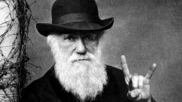

```{r setup, include=FALSE}
knitr::opts_chunk$set(echo = TRUE)
```

# Introdução

Primeiro alguns links:

- [Roteiro para elaboração da monografia final](http://diogro.github.io/BioEvol/roteiro.html)
- [Apostila da disciplina](https://github.com/lem-usp/apostila-bio-evol/blob/master/apostila-Bio312.pdf?raw=true)



## Aulas

1. [Aula 1 - Genética quantitativa e evolução](http://diogro.github.io/BioEvol/aula1.html)
2. [Aula 2 - Matrizes de covariância](http://diogro.github.io/BioEvol/aula2.html)
3. [Aula 3 - Componentes principais](http://diogro.github.io/BioEvol/aula3.html)
4. [Aula 4 - Estados ancestrais e resposta evolutiva](http://diogro.github.io/BioEvol/aula4.html)
<!-- 4. [Aula 4.1 - Reconstrução ancestral por parcimônia linear](http://diogro.github.io/BioEvol/aula4.1.html) -->
5. [Aula 5 - Matrizes Ancestrais](http://diogro.github.io/BioEvol/aula5.html)
6. [Aula 6 - Gradientes de Seleção](http://diogro.github.io/BioEvol/aula6.html)
7. [Aula 7 - Análise de Variância](http://diogro.github.io/BioEvol/analise_variancia.html)
